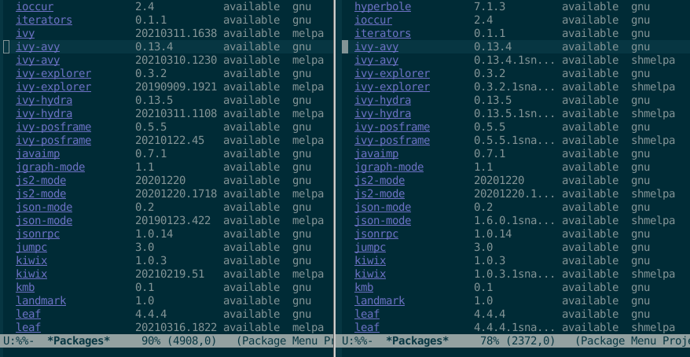

> MELPA came along and destroyed the versioning scheme. Still kind of mad about that.
>
> &mdash; <cite>Someone with the handle "/u/tromey" claiming original authorship of `package.el`.</cite>

# shmelpa


*Left-frame melpa versions bear no relation to gnu's.  Right-frame shmelpa versions dovetail.*

# faq

## Why?

The ``package-install`` command will generally not update a bumped package dependency because MELPA's timestamp versioning is incompatible with the semantic version numbers in `Package-Requires` clauses (the Schism).

The particulars of the Schism are expatiated in uninteresting detail in [Issue 2944](https://github.com/melpa/melpa/issues/2944).

## How can I try it out?

Comment out your original `add-to-list` of melpa, and insert the following in `.emacs`:

```
;;; (add-to-list 'package-archives
;;;   '("melpa" . "https://melpa.org/packages/"))

(add-to-list 'package-archives
  '("shmelpa" . "http://shmelpa.commandlinesystems.com/packages/"))
```

If you don't comment out the melpa line, melpa's numerically greater versions will mask shmelpa's lowly semantic versions.

## What does shmelpa stand for?

"shmelpa" is not an acronym, but [shm-reduplication](https://en.wikipedia.org/wiki/Shm-reduplication) of its predecessor.
